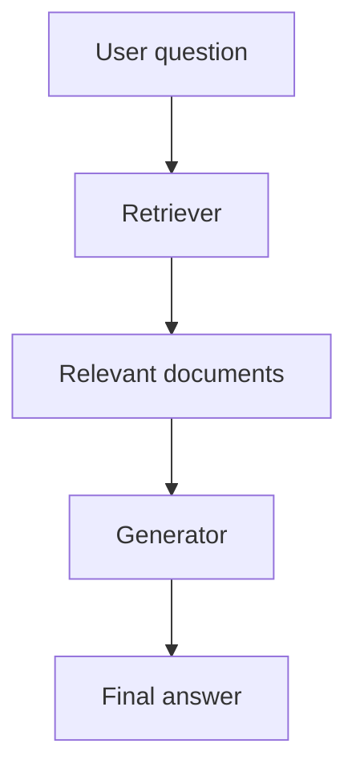

## 🧠 2–Dars: Generative AI + Retrieval qanday ishlaydi?


### 🎯 Maqsad:

Bu darsda sen:

* Retrieval bilan Generation qanday kombinatsiyada ishlashini
* Ushbu ikki bosqich orasidagi oqim qanday bo‘lishini
* Qanday qilib ma’lumotdan foydali javob hosil qilinishini
  chuqur tushunib olasan.

---

### 🔁 RAG Ishlash Ketma-ketligi

RAG modeli 3 bosqichli pipeline'dan iborat:

1. **Query** (foydalanuvchi savoli)
2. **Retrieval** (savolga tegishli ma’lumotlarni izlab topish)
3. **Generation** (topilgan ma’lumot asosida javob yozish)

Bu ketma-ketlik quyidagicha ishlaydi:

```
User question  →  Retriever  →  Relevant docs  →  Generator  →  Final answer
```

---

### 🧩 Har bir bo‘limda nima bo‘ladi?

#### 1️⃣ **Query:**

Foydalanuvchi tomonidan berilgan savol.

```text
"Chingiz Aytmatovning eng mashhur asari qaysi?"
```

#### 2️⃣ **Retriever:**

Bu modul so‘rovga mos bo‘lgan hujjatlarni (yoki matn bo‘laklarini) ma’lumotlar bazasidan topadi.

👨‍💻 Texnik jihatdan:

* Foydalanuvchi so‘rovi vektorga aylantiriladi (`query embedding`)
* So‘rov vektori ma’lumotlar bazasidagi hujjat vektorlari bilan taqqoslanadi
* Eng yaqin (relevant) vektorlar tanlab olinadi

📦 Bu yerda ishlatiladigan vositalar:

* `BM25` (klassik)
* `FAISS`, `Annoy`, `Qdrant`, `Pinecone` (modern vector search)

#### 3️⃣ **Generator:**

Topilgan matnlarni o‘qib chiqadi va foydalanuvchiga moslashtirilgan javob yaratadi.

💡 Bu qismda ishlatiladigan model:

* GPT-3.5/4, LLaMA, T5, Claude, Mistral, t5-base, va boshqalar.

---

### 🎨 Visualization



---

### 📍 Misol: RAG so‘zlab beradi

> **So‘rov:** “O‘zbekistonda internet tezligi nechchi 2024-yilda?”

1. Retriever: saytlardan quyidagi ma’lumotni topadi:

   * "Ookla'ning 2024-yil yanvar hisobotiga ko‘ra, O‘zbekistonda mobil internet tezligi o‘rtacha 24.6 Mbps."
2. Generator: shuni o‘qib, bunday deydi:

   > “2024-yil holatiga ko‘ra, O‘zbekistonda mobil internetning o‘rtacha tezligi 24.6 Mbps ni tashkil qiladi (manba: Ookla hisobotidan).”

---

### ⚠️ Muhim nuqtalar:

* **Retriever yomon bo‘lsa**, model noto‘g‘ri ma’lumot asosida halokatli javob yozadi.
* **Generator noto‘g‘ri ishlasa**, to‘g‘ri ma’lumotni buzib yuboradi.
* Ikkalasini ham optimallashtirish shart.

---

### 🔄 RAGning ikki asosiy varianti

| Variant                      | Tavsif                                                      |
| ---------------------------- | ----------------------------------------------------------- |
| **Fusion-in-Decoder (FiD)**  | Ko‘p hujjatlarni generatorga parallel uzatadi               |
| **RAG-Sequence / RAG-Token** | Har bir token generatsiya qilishda hujjatlardan foydalanadi |

FiD — yanada keng tarqalgan, chunki u GPT bilan yaxshiroq ishlaydi.

---

### ✅ Uyga vazifa:

1. `Fusion-in-Decoder` arxitekturasi haqida Google’da o‘qi.
2. HuggingFace’dagi `facebook/rag-token-nq` modelini topib ko‘r.

---
