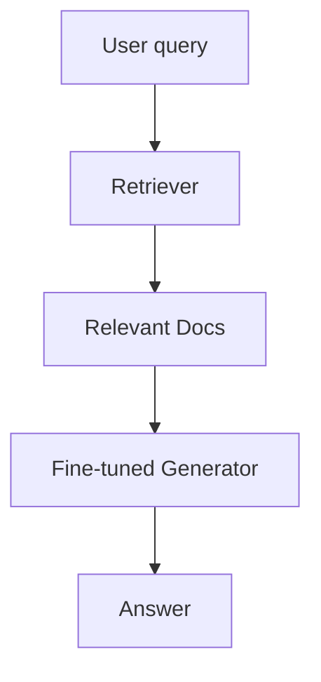

## 🎓 3–Dars: RAG vs Fine-tuning — Qachon qaysi biri kerak?

### 🎯 Maqsad:

* RAG va fine-tuning o‘rtasidagi **asosiy farqlarni tushunish**
* Real loyihalarda **qaysi yondashuvni tanlash** kerakligini aniqlash
* Har ikkalasining **kuchli va zaif tomonlarini** ko‘rib chiqish

---

### ⚔️ RAG va Fine-tuning — taqqoslash jadvali

| Xususiyatlar              | Fine-tuning                              | RAG                                          |
| ------------------------- | ---------------------------------------- | -------------------------------------------- |
| **Ma’lumot yangilanishi** | Modelni qayta train qilish kerak         | Ma’lumot bazasini yangilash kifoya           |
| **Trening xarajati**      | Juda qimmat (GPU, data labeling)         | Arzonroq: retriever + vector DB              |
| **Scalability**           | Har yangi ma’lumot uchun training kerak  | Hujjatlarni qo‘shish kifoya                  |
| **Explainability**        | Qiyin                                    | Yaxshi — qaysi hujjatdan olingani ko‘rinadi  |
| **Context yirikligi**     | Modelga sig‘adigancha                    | Document chunking orqali katta bazadan olish |
| **Hallucination**         | Ko‘proq (model yodlagan narsaga bog‘liq) | Kamroq (agar relevant ma’lumot bo‘lsa)       |
| **Real-time ma’lumot**    | Yo‘q                                     | Ha, mumkin                                   |

---

### 🧪 Real use-case lardan misollar:

#### 📚 Use-case 1: Online huquqiy maslahat sayti

* **Talab:** Har kuni yangi qonunlar, hujjatlar qo‘shiladi.
* **Eng yaxshi yechim:** RAG (hujjatlarni tezda yangilab turish mumkin)

#### 🎮 Use-case 2: Kompyuter o‘yinini tushunadigan AI bot

* **Talab:** O‘yin qoidalarini va tilini chuqur o‘rgansin
* **Eng yaxshi yechim:** Fine-tuning (ko‘p kontekstda doimiy javoblar kerak)

#### 💬 Use-case 3: Kompaniya ichki hujjatlar asosida chatbot

* **Talab:** Hujjatlar soni 10 ming, tez-tez yangilanadi
* **Eng yaxshi yechim:** RAG (retriever yordamida hujjatlarni o‘qib turadi)

---

### 💡 Qoidalar:

#### ✅ Qachon **RAG** tanlash kerak:

* Ma’lumot ko‘p va tez o‘zgarib turadi
* Real-time ishlov kerak
* FAQ, chat bot, hujjat o‘qish, PDF tizimlar
* Modelni qayta train qilishga vaqt/GPUs yo‘q

#### ✅ Qachon **Fine-tuning** kerak:

* Ma’lumotlar o‘zgarmaydi, statik
* Modeldan bir xil, chuqur javoblar kutilyapti
* Judayam maxsus task: medical diagnosis, legal classification
* Qisqa kontekstli tasklar (classification, intent prediction)

---

### 🔍 Kombinatsiya (Hybrid RAG + fine-tune):

Ko‘p hollarda, **ikkalasini birga** ishlatish eng zo‘ri bo‘ladi:

1. Fine-tune qilingan modelga maxsus domain logic beriladi
2. Retriever esa kerakli external knowledge’ni olib beradi

---

### ✅ Uyga vazifa:

1. O‘zingdagi loyihalardan birini ko‘zdan kechir va tahlil qil: RAGmi kerak, fine-tuningmi?
2. HuggingFace’dan `falcon-rag` yoki `facebook/rag-token-base` ni ko‘rib chiqing.
