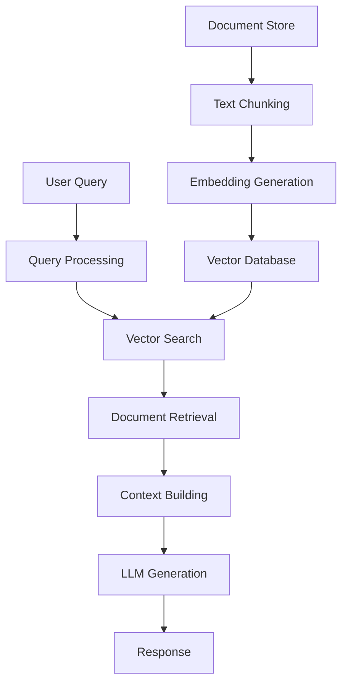

# RAG (Retrieval-Augmented Generation) - To'liq O'quv Darslik

## 📚 Mundarija

1. [RAG nima va nima uchun kerak?](#rag-nima)
2. [RAG arxitekturasi va komponentlari](#arxitektura)
3. [Amaliy loyiha: 10,000+ hujjat uchun RAG chatbot](#amaliy-loyiha)
4. [Kod misollar (Jupyter Notebook)](#kod-misollar)
5. [Ilg'or texnikalar](#ilgor-texnikalar)
6. [Optimizatsiya va Scale qilish](#optimizatsiya)
7. [Deployment va Production](#deployment)
8. [Troubleshooting](#troubleshooting)

---

## 🤖 RAG nima va nima uchun kerak? {#rag-nima}

### RAG ta'rifi

**Retrieval-Augmented Generation (RAG)** - bu sun'iy intellekt texnikasi bo'lib, u ma'lumotlarni qidirish (retrieval) va matn generatsiya qilishni birlashtiradi. Oddiy qilib aytganda, RAG sizning mavjud ma'lumotlaringizdan eng mos javoblarni topib, ularni asosida yangi, to'liq javoblar yaratadi.

### Nima uchun RAG kerak?

#### Muammo: LLM limitlari
- **Ma'lumotlar yangilanmaydi**: GPT-4 faqat o'z training datasi asosida ishlaydi
- **Hallucination**: Model mavjud bo'lmagan ma'lumotlarni o'ylab topishi mumkin
- **Kontekst limitlari**: Uzun hujjatlarni to'liq o'qiy olmaydi
- **Maxfiy ma'lumotlar**: Kompaniya ma'lumotlari training datasida yo'q

#### Yechim: RAG
- ✅ **Real-time ma'lumotlar**: Har doim yangi ma'lumotlar bilan ishlaydi
- ✅ **Aniq javoblar**: Faqat mavjud ma'lumotlar asosida javob beradi
- ✅ **Scalable**: Millionlab hujjat bilan ishlash mumkin
- ✅ **Kontrol**: Qaysi ma'lumotlardan foydalanishni boshqarish mumkin

---

## 🏗️ RAG arxitekturasi va komponentlari {#arxitektura}

### RAG ning asosiy qismlari



### 1. **Document Processing Pipeline**
- **Text Extraction**: PDF, DOCX, HTML dan matn chiqarish
- **Chunking**: Katta hujjatlarni kichik bo'laklarga bo'lish
- **Embedding**: Har bir chunk uchun vector yaratish
- **Storage**: Vector database ga saqlash

### 2. **Query Processing**
- **Query Analysis**: Savolni tahlil qilish
- **Embedding**: Savol uchun vector yaratish
- **Search**: Eng mos chunkларni topish

### 3. **Generation**
- **Context Building**: Topilgan ma'lumotlarni birlashtirish
- **Prompt Engineering**: LLM uchun to'g'ri prompt yaratish
- **Response Generation**: Yakuniy javob yaratish

---

## 💻 Kod misollar (Jupyter Notebook) {#kod-misollar}

### 1-qadam: Environment setup

```python
# requirements.txt yaratish
"""
langchain==0.1.0
chromadb==0.4.22
openai==1.10.0
streamlit==1.30.0
PyPDF2==3.0.1
python-docx==1.1.0
beautifulsoup4==4.12.2
requests==2.31.0
python-dotenv==1.0.0
tiktoken==0.5.2
"""

# Virtual environment yaratish
# python -m venv rag_env
# source rag_env/bin/activate  # Linux/Mac
# rag_env\Scripts\activate     # Windows

# Paketlarni o'rnatish
# pip install -r requirements.txt
```

### 2-qadam: Konfiguratsiya va imports

```python
import os
import openai
from dotenv import load_dotenv
import chromadb
from chromadb.config import Settings
from langchain.text_splitter import RecursiveCharacterTextSplitter
from langchain.embeddings import OpenAIEmbeddings
from langchain.vectorstores import Chroma
from langchain.document_loaders import PyPDFLoader, Docx2txtLoader, TextLoader
from langchain.llms import OpenAI
from langchain.chains import RetrievalQA
import PyPDF2
import docx
from bs4 import BeautifulSoup
import requests
import streamlit as st
import json
from pathlib import Path
import logging

# Logging setup
logging.basicConfig(level=logging.INFO)
logger = logging.getLogger(__name__)

# Environment variables yuklash
load_dotenv()

# OpenAI API key
openai.api_key = os.getenv('OPENAI_API_KEY')

# Asosiy konfiguratsiya
class RAGConfig:
    CHUNK_SIZE = 1000
    CHUNK_OVERLAP = 200
    VECTOR_DB_PATH = "./chroma_db"
    MAX_DOCS_PER_QUERY = 5
    TEMPERATURE = 0.1
    MODEL_NAME = "gpt-3.5-turbo"
    EMBEDDING_MODEL = "text-embedding-ada-002"
```

### 3-qadam: Document Loader Class

```python
class DocumentLoader:
    """Turli formatdagi hujjatlarni yuklash uchun class"""
    
    def __init__(self):
        self.supported_formats = ['.pdf', '.docx', '.txt', '.html']
    
    def load_pdf(self, file_path: str) -> str:
        """PDF hujjatdan matn chiqarish"""
        try:
            with open(file_path, 'rb') as file:
                pdf_reader = PyPDF2.PdfReader(file)
                text = ""
                for page_num in range(len(pdf_reader.pages)):
                    page = pdf_reader.pages[page_num]
                    text += page.extract_text()
                return text
        except Exception as e:
            logger.error(f"PDF yuklashda xatolik {file_path}: {e}")
            return ""
    
    def load_docx(self, file_path: str) -> str:
        """DOCX hujjatdan matn chiqarish"""
        try:
            doc = docx.Document(file_path)
            text = ""
            for paragraph in doc.paragraphs:
                text += paragraph.text + "\n"
            return text
        except Exception as e:
            logger.error(f"DOCX yuklashda xatolik {file_path}: {e}")
            return ""
    
    def load_txt(self, file_path: str) -> str:
        """TXT fayldan matn o'qish"""
        try:
            with open(file_path, 'r', encoding='utf-8') as file:
                return file.read()
        except Exception as e:
            logger.error(f"TXT yuklashda xatolik {file_path}: {e}")
            return ""
    
    def load_html(self, file_path: str) -> str:
        """HTML fayldan matn chiqarish"""
        try:
            with open(file_path, 'r', encoding='utf-8') as file:
                soup = BeautifulSoup(file.read(), 'html.parser')
                return soup.get_text()
        except Exception as e:
            logger.error(f"HTML yuklashda xatolik {file_path}: {e}")
            return ""
    
    def load_website(self, url: str) -> str:
        """Veb-saytdan matn chiqarish"""
        try:
            response = requests.get(url)
            response.raise_for_status()
            soup = BeautifulSoup(response.content, 'html.parser')
            return soup.get_text()
        except Exception as e:
            logger.error(f"Website yuklashda xatolik {url}: {e}")
            return ""
    
    def load_document(self, file_path: str) -> str:
        """Fayl formatiga qarab mos loader chaqirish"""
        file_extension = Path(file_path).suffix.lower()
        
        if file_extension == '.pdf':
            return self.load_pdf(file_path)
        elif file_extension == '.docx':
            return self.load_docx(file_path)
        elif file_extension == '.txt':
            return self.load_txt(file_path)
        elif file_extension == '.html':
            return self.load_html(file_path)
        else:
            logger.warning(f"Qo'llab-quvvatlanmaydigan format: {file_extension}")
            return ""
```

### 4-qadam: Text Chunking

```python
class TextChunker:
    """Matnni kichik bo'laklarga bo'lish uchun class"""
    
    def __init__(self, chunk_size: int = 1000, chunk_overlap: int = 200):
        self.chunk_size = chunk_size
        self.chunk_overlap = chunk_overlap
        self.text_splitter = RecursiveCharacterTextSplitter(
            chunk_size=chunk_size,
            chunk_overlap=chunk_overlap,
            length_function=len,
            separators=["\n\n", "\n", " ", ""]
        )
    
    def chunk_text(self, text: str, source: str = "") -> list:
        """Matnni chunklarga bo'lish"""
        if not text.strip():
            return []
        
        chunks = self.text_splitter.split_text(text)
        
        # Har bir chunk uchun metadata qo'shish
        chunked_docs = []
        for i, chunk in enumerate(chunks):
            if len(chunk.strip()) > 50:  # Juda qisqa chunkларni o'tkazib yuborish
                chunked_docs.append({
                    'content': chunk,
                    'source': source,
                    'chunk_id': i,
                    'length': len(chunk)
                })
        
        return chunked_docs
    
    def get_chunk_stats(self, chunks: list) -> dict:
        """Chunk statistikalari"""
        if not chunks:
            return {}
        
        lengths = [chunk['length'] for chunk in chunks]
        return {
            'total_chunks': len(chunks),
            'avg_length': sum(lengths) / len(lengths),
            'min_length': min(lengths),
            'max_length': max(lengths)
        }
```

### 5-qadam: Vector Database Setup

```python
class VectorDatabase:
    """Vector database bilan ishlash uchun class"""
    
    def __init__(self, db_path: str = "./chroma_db"):
        self.db_path = db_path
        self.embeddings = OpenAIEmbeddings()
        self.client = chromadb.PersistentClient(path=db_path)
        self.collection = None
        self.vectorstore = None
    
    def create_collection(self, collection_name: str = "documents"):
        """Yangi collection yaratish"""
        try:
            self.collection = self.client.create_collection(
                name=collection_name,
                metadata={"hnsw:space": "cosine"}
            )
            logger.info(f"Collection '{collection_name}' yaratildi")
        except Exception as e:
            logger.info(f"Collection '{collection_name}' allaqachon mavjud")
            self.collection = self.client.get_collection(collection_name)
    
    def add_documents(self, chunks: list, batch_size: int = 100):
        """Chunkларni vector database ga qo'shish"""
        if not self.collection:
            raise ValueError("Collection yaratilmagan")
        
        total_chunks = len(chunks)
        logger.info(f"Jami {total_chunks} ta chunk qo'shilmoqda...")
        
        for i in range(0, total_chunks, batch_size):
            batch = chunks[i:i + batch_size]
            
            # Batch uchun embedding yaratish
            texts = [chunk['content'] for chunk in batch]
            metadatas = [{
                'source': chunk['source'],
                'chunk_id': chunk['chunk_id'],
                'length': chunk['length']
            } for chunk in batch]
            
            # Unique ID lar yaratish
            ids = [f"{chunk['source']}_chunk_{chunk['chunk_id']}" for chunk in batch]
            
            try:
                # Vector database ga qo'shish
                self.collection.add(
                    documents=texts,
                    metadatas=metadatas,
                    ids=ids
                )
                logger.info(f"Batch {i//batch_size + 1}/{(total_chunks-1)//batch_size + 1} qo'shildi")
                
            except Exception as e:
                logger.error(f"Batch qo'shishda xatolik: {e}")
    
    def search_similar(self, query: str, n_results: int = 5) -> list:
        """O'xshash hujjatlarni qidirish"""
        if not self.collection:
            raise ValueError("Collection mavjud emas")
        
        try:
            results = self.collection.query(
                query_texts=[query],
                n_results=n_results
            )
            
            # Natijalarni formatlash
            formatted_results = []
            for i in range(len(results['documents'][0])):
                formatted_results.append({
                    'content': results['documents'][0][i],
                    'metadata': results['metadatas'][0][i],
                    'distance': results['distances'][0][i] if 'distances' in results else 0
                })
            
            return formatted_results
            
        except Exception as e:
            logger.error(f"Qidirishda xatolik: {e}")
            return []
    
    def get_collection_stats(self) -> dict:
        """Collection statistikalari"""
        if not self.collection:
            return {}
        
        count = self.collection.count()
        return {
            'total_documents': count,
            'collection_name': self.collection.name
        }
```

### 6-qadam: RAG Pipeline

```python
class RAGPipeline:
    """RAG pipelineni boshqarish uchun asosiy class"""
    
    def __init__(self, config: RAGConfig):
        self.config = config
        self.doc_loader = DocumentLoader()
        self.text_chunker = TextChunker(
            chunk_size=config.CHUNK_SIZE,
            chunk_overlap=config.CHUNK_OVERLAP
        )
        self.vector_db = VectorDatabase(config.VECTOR_DB_PATH)
        self.llm = OpenAI(
            temperature=config.TEMPERATURE,
            model_name=config.MODEL_NAME
        )
    
    def process_documents(self, file_paths: list, collection_name: str = "documents"):
        """Hujjatlarni qayta ishlash va database ga saqlash"""
        
        # Collection yaratish
        self.vector_db.create_collection(collection_name)
        
        all_chunks = []
        successful_files = 0
        
        logger.info(f"Jami {len(file_paths)} ta fayl qayta ishlanmoqda...")
        
        for file_path in file_paths:
            try:
                # Hujjatni yuklash
                logger.info(f"Qayta ishlanmoqda: {file_path}")
                text = self.doc_loader.load_document(file_path)
                
                if not text.strip():
                    logger.warning(f"Bo'sh fayl: {file_path}")
                    continue
                
                # Chunklarga bo'lish
                chunks = self.text_chunker.chunk_text(text, source=file_path)
                all_chunks.extend(chunks)
                
                successful_files += 1
                logger.info(f"✅ {file_path}: {len(chunks)} ta chunk")
                
            except Exception as e:
                logger.error(f"❌ {file_path}: {e}")
        
        # Vector database ga saqlash
        if all_chunks:
            self.vector_db.add_documents(all_chunks)
            
            # Statistika
            stats = self.text_chunker.get_chunk_stats(all_chunks)
            logger.info(f"""
            📊 Qayta ishlash tugadi:
            - Muvaffaqiyatli fayllar: {successful_files}/{len(file_paths)}
            - Jami chunklar: {stats.get('total_chunks', 0)}
            - O'rtacha chunk uzunligi: {stats.get('avg_length', 0):.0f} belgi
            """)
        else:
            logger.warning("Hech qanday chunk yaratilmadi!")
    
    def query(self, question: str, max_docs: int = None) -> dict:
        """Savolga javob berish"""
        if max_docs is None:
            max_docs = self.config.MAX_DOCS_PER_QUERY
        
        try:
            # 1. O'xshash hujjatlarni topish
            similar_docs = self.vector_db.search_similar(question, n_results=max_docs)
            
            if not similar_docs:
                return {
                    'answer': "Kechirasiz, sizning savolingizga mos ma'lumot topilmadi.",
                    'sources': [],
                    'confidence': 0
                }
            
            # 2. Kontekst yaratish
            context = self._build_context(similar_docs)
            
            # 3. Prompt yaratish
            prompt = self._build_prompt(question, context)
            
            # 4. LLM dan javob olish
            response = self.llm(prompt)
            
            # 5. Javobni formatlash
            return {
                'answer': response.strip(),
                'sources': [doc['metadata']['source'] for doc in similar_docs],
                'context_used': len(similar_docs),
                'confidence': self._calculate_confidence(similar_docs)
            }
            
        except Exception as e:
            logger.error(f"Query da xatolik: {e}")
            return {
                'answer': "Xatolik yuz berdi. Iltimos qaytadan urinib ko'ring.",
                'sources': [],
                'confidence': 0
            }
    
    def _build_context(self, similar_docs: list) -> str:
        """O'xshash hujjatlardan kontekst yaratish"""
        context_parts = []
        
        for i, doc in enumerate(similar_docs, 1):
            context_parts.append(f"Ma'lumot {i}:\n{doc['content']}\n")
        
        return "\n".join(context_parts)
    
    def _build_prompt(self, question: str, context: str) -> str:
        """LLM uchun prompt yaratish"""
        prompt = f"""
Quyidagi ma'lumotlar asosida savolga aniq va to'liq javob bering.
Faqat berilgan ma'lumotlar asosida javob bering, o'zingizdan ma'lumot qo'shmang.

Ma'lumotlar:
{context}

Savol: {question}

Javob:"""
        return prompt
    
    def _calculate_confidence(self, similar_docs: list) -> float:
        """Javob ishonchlilik darajasini hisoblash"""
        if not similar_docs:
            return 0.0
        
        # Distance ga asoslangan confidence
        avg_distance = sum(doc.get('distance', 1.0) for doc in similar_docs) / len(similar_docs)
        confidence = max(0, min(1, 1 - avg_distance))
        
        return round(confidence * 100, 1)
```

### 7-qadam: Streamlit UI yaratish

```python
import streamlit as st
import time

def create_streamlit_app():
    """Streamlit web interface yaratish"""
    
    st.set_page_config(
        page_title="RAG ChatBot",
        page_icon="🤖",
        layout="wide"
    )
    
    st.title("🤖 RAG ChatBot")
    st.markdown("10,000+ hujjat asosida intelligent chatbot")
    
    # Sidebar
    with st.sidebar:
        st.header("⚙️ Sozlamalar")
        
        # Upload files
        uploaded_files = st.file_uploader(
            "Hujjatlarni yuklang",
            type=['pdf', 'docx', 'txt'],
            accept_multiple_files=True
        )
        
        # Process button
        if st.button("📁 Hujjatlarni qayta ishlash"):
            if uploaded_files:
                with st.spinner("Hujjatlar qayta ishlanmoqda..."):
                    process_uploaded_files(uploaded_files)
                st.success("✅ Hujjatlar muvaffaqiyatli qayta ishlandi!")
            else:
                st.warning("Iltimos hujjatlarni yuklang")
        
        st.markdown("---")
        
        # Statistics
        st.header("📊 Statistika")
        if 'rag_pipeline' in st.session_state:
            stats = st.session_state.rag_pipeline.vector_db.get_collection_stats()
            st.metric("Jami hujjatlar", stats.get('total_documents', 0))
    
    # Main chat interface
    if 'messages' not in st.session_state:
        st.session_state.messages = []
    
    # Chat messages
    for message in st.session_state.messages:
        with st.chat_message(message["role"]):
            st.markdown(message["content"])
            if "sources" in message:
                with st.expander("📚 Manbalar"):
                    for source in message["sources"]:
                        st.write(f"- {source}")
    
    # Chat input
    if prompt := st.chat_input("Savolingizni yozing..."):
        # User message
        st.session_state.messages.append({"role": "user", "content": prompt})
        with st.chat_message("user"):
            st.markdown(prompt)
        
        # Bot response
        with st.chat_message("assistant"):
            if 'rag_pipeline' not in st.session_state:
                st.markdown("❌ Iltimos avval hujjatlarni yuklang va qayta ishlang.")
            else:
                with st.spinner("Javob tayyorlanmoqda..."):
                    response = st.session_state.rag_pipeline.query(prompt)
                
                st.markdown(response['answer'])
                
                # Sources
                if response['sources']:
                    with st.expander("📚 Manbalar"):
                        for source in set(response['sources']):
                            st.write(f"- {source}")
                
                # Confidence
                st.caption(f"Ishonchlilik: {response['confidence']}%")
                
                # Save message
                st.session_state.messages.append({
                    "role": "assistant",
                    "content": response['answer'],
                    "sources": response['sources'],
                    "confidence": response['confidence']
                })

def process_uploaded_files(uploaded_files):
    """Yuklangan fayllarni qayta ishlash"""
    
    # RAG pipeline yaratish
    config = RAGConfig()
    rag_pipeline = RAGPipeline(config)
    
    # Temporary fayllarni saqlash
    temp_paths = []
    for uploaded_file in uploaded_files:
        temp_path = f"./temp_{uploaded_file.name}"
        with open(temp_path, "wb") as f:
            f.write(uploaded_file.getbuffer())
        temp_paths.append(temp_path)
    
    # Hujjatlarni qayta ishlash
    rag_pipeline.process_documents(temp_paths)
    
    # Session state ga saqlash
    st.session_state.rag_pipeline = rag_pipeline
    
    # Temporary fayllarni o'chirish
    for temp_path in temp_paths:
        try:
            os.remove(temp_path)
        except:
            pass

if __name__ == "__main__":
    create_streamlit_app()
```

### 8-qadam: Bulk Processing Script

```python
# bulk_processor.py
import os
import glob
from pathlib import Path
import argparse

def bulk_process_documents(documents_folder: str):
    """Papkadagi barcha hujjatlarni bulk qayta ishlash"""
    
    # Qo'llab-quvvatlanadigan formatlar
    supported_extensions = ['*.pdf', '*.docx', '*.txt', '*.html']
    
    # Barcha fayllarni topish
    all_files = []
    for extension in supported_extensions:
        pattern = os.path.join(documents_folder, '**', extension)
        files = glob.glob(pattern, recursive=True)
        all_files.extend(files)
    
    logger.info(f"Topilgan fayllar: {len(all_files)}")
    
    # RAG pipeline yaratish
    config = RAGConfig()
    rag_pipeline = RAGPipeline(config)
    
    # Bulk qayta ishlash
    rag_pipeline.process_documents(all_files, collection_name="bulk_documents")
    
    logger.info("✅ Bulk qayta ishlash tugadi!")
    
    return rag_pipeline

def interactive_query_session(rag_pipeline):
    """Interaktiv savol-javob sessiyasi"""
    print("\n🤖 RAG ChatBot tayyor!")
    print("Savolingizni yozing (chiqish uchun 'exit' yozing):\n")
    
    while True:
        question = input("❓ Savol: ").strip()
        
        if question.lower() in ['exit', 'quit', 'chiqish']:
            print("👋 Xayr!")
            break
        
        if not question:
            continue
        
        print("🔍 Qidirilmoqda...")
        response = rag_pipeline.query(question)
        
        print(f"\n🤖 Javob: {response['answer']}")
        print(f"📊 Ishonchlilik: {response['confidence']}%")
        print(f"📚 Manbalar: {len(set(response['sources']))} ta hujjat\n")
        print("-" * 50)

if __name__ == "__main__":
    parser = argparse.ArgumentParser(description='RAG bulk processor')
    parser.add_argument('--documents', required=True, help='Hujjatlar papkasi')
    parser.add_argument('--interactive', action='store_true', help='Interaktiv rejim')
    
    args = parser.parse_args()
    
    # Bulk qayta ishlash
    rag_pipeline = bulk_process_documents(args.documents)
    
    # Interaktiv rejim
    if args.interactive:
        interactive_query_session(rag_pipeline)
```

---

## 🔬 Ilg'or texnikalar {#ilgor-texnikalar}

### 1. Advanced Chunking Strategiyalari

```python
class AdvancedTextChunker:
    """Ilg'or chunking strategiyalari"""
    
    def __init__(self):
        self.strategies = {
            'semantic': self._semantic_chunking,
            'sliding_window': self._sliding_window_chunking,
            'hierarchical': self._hierarchical_chunking
        }
    
    def _semantic_chunking(self, text: str, threshold: float = 0.7):
        """Semantik ma'noga asoslangan chunking"""
        sentences = text.split('. ')
        chunks = []
        current_chunk = []
        
        for i, sentence in enumerate(sentences):
            current_chunk.append(sentence)
            
            # Har 3-5 jumladan keyin semantik o'xshashlikni tekshirish
            if len(current_chunk) >= 3 and i < len(sentences) - 1:
                current_text = '. '.join(current_chunk)
                next_sentence = sentences[i + 1]
                
                # Embedding orqali o'xshashlikni hisoblash
                similarity = self._calculate_semantic_similarity(current_text, next_sentence)
                
                if similarity < threshold:
                    chunks.append('. '.join(current_chunk))
                    current_chunk = []
        
        if current_chunk:
            chunks.append('. '.join(current_chunk))
        
        return chunks
    
    def _sliding_window_chunking(self, text: str, window_size: int = 500, step_size: int = 250):
        """Sliding window chunking - overlap bilan"""
        chunks = []
        text_length = len(text)
        
        for start in range(0, text_length, step_size):
            end = min(start + window_size, text_length)
            chunk = text[start:end]
            
            # Chunk oxirini to'g'ri so'z bilan tugatish
            if end < text_length:
                last_space = chunk.rfind(' ')
                if last_space > len(chunk) * 0.8:  # 80% dan ko'p bo'lsa
                    chunk = chunk[:last_space]
            
            chunks.append(chunk)
            
            if end >= text_length:
                break
        
        return chunks
    
    def _hierarchical_chunking(self, text: str):
        """Ierarxik chunking - bosh sahifa, bo'lim, paragraf"""
        chunks = []
        
        # 1-daraja: Bosh sahifalar (### bilan)
        sections = text.split('###')
        
        for section in sections:
            if not section.strip():
                continue
                
            # 2-daraja: Bo'limlar (## bilan)
            subsections = section.split('##')
            
            for subsection in subsections:
                if not subsection.strip():
                    continue
                
                # 3-daraja: Paragraflar
                paragraphs = subsection.split('\n\n')
                
                current_chunk = ""
                for paragraph in paragraphs:
                    if len(current_chunk + paragraph) > 1000:
                        if current_chunk:
                            chunks.append(current_chunk.strip())
                        current_chunk = paragraph
                    else:
                        current_chunk += "\n\n" + paragraph if current_chunk else paragraph
                
                if current_chunk:
                    chunks.append(current_chunk.strip())
        
        return chunks

### 2. Hybrid Search (Dense + Sparse)

```python
class HybridSearchEngine:
    """Dense va Sparse qidiruvni birlashtirgan engine"""
    
    def __init__(self):
        self.dense_searcher = None  # Vector search
        self.sparse_searcher = None  # BM25/TF-IDF search
        
    def setup_sparse_search(self, documents: list):
        """BM25 asosida sparse search o'rnatish"""
        from rank_bm25 import BM25Okapi
        import nltk
        from nltk.tokenize import word_tokenize
        
        # Tokenize documents
        tokenized_docs = []
        for doc in documents:
            tokens = word_tokenize(doc.lower())
            tokenized_docs.append(tokens)
        
        self.sparse_searcher = BM25Okapi(tokenized_docs)
        self.documents = documents
    
    def hybrid_search(self, query: str, alpha: float = 0.7, k: int = 10):
        """Hybrid search: alpha * dense + (1-alpha) * sparse"""
        
        # Dense search
        dense_results = self.dense_searcher.search_similar(query, n_results=k*2)
        
        # Sparse search
        query_tokens = word_tokenize(query.lower())
        sparse_scores = self.sparse_searcher.get_scores(query_tokens)
        
        # Natijalarni normalizatsiya qilish
        dense_scores = {i: 1 - res['distance'] for i, res in enumerate(dense_results)}
        sparse_scores_norm = {i: score/max(sparse_scores) for i, score in enumerate(sparse_scores)}
        
        # Hybrid score hisoblash
        final_scores = {}
        for i in range(min(len(dense_results), len(self.documents))):
            dense_score = dense_scores.get(i, 0)
            sparse_score = sparse_scores_norm.get(i, 0)
            final_scores[i] = alpha * dense_score + (1 - alpha) * sparse_score
        
        # Top k ni qaytarish
        sorted_results = sorted(final_scores.items(), key=lambda x: x[1], reverse=True)[:k]
        
        return [dense_results[i] for i, _ in sorted_results]

### 3. Query Enhancement

```python
class QueryEnhancer:
    """Savollarni yaxshilash va kengaytirish"""
    
    def __init__(self, llm):
        self.llm = llm
    
    def expand_query(self, query: str) -> list:
        """Savolni kengaytirish va sinonimlar qo'shish"""
        expansion_prompt = f"""
        Quyidagi savolga o'xshash 3 ta qo'shimcha savol yarating:
        Asl savol: {query}
        
        Qo'shimcha savollar:
        1.
        2.
        3.
        """
        
        response = self.llm(expansion_prompt)
        expanded_queries = [query]  # Asl savolni ham qo'shish
        
        # Response dan savollarni chiqarish
        lines = response.strip().split('\n')
        for line in lines:
            if line.strip() and any(char.isdigit() for char in line[:3]):
                clean_query = line.split('.', 1)[-1].strip()
                if clean_query:
                    expanded_queries.append(clean_query)
        
        return expanded_queries
    
    def rephrase_query(self, query: str) -> str:
        """Savolni qayta ifodalash"""
        rephrase_prompt = f"""
        Quyidagi savolni boshqacha so'zlar bilan qayta yozing, ma'nosini o'zgartirmang:
        
        Asl savol: {query}
        Qayta yozilgan savol:
        """
        
        return self.llm(rephrase_prompt).strip()
    
    def extract_intent(self, query: str) -> dict:
        """Savol niyatini aniqlash"""
        intent_prompt = f"""
        Quyidagi savolning turini aniqlang:
        
        Savol: {query}
        
        Turlar:
        - factual: Aniq faktlar haqida
        - procedural: Jarayon haqida
        - conceptual: Tushuncha haqida
        - comparison: Taqqoslash
        - troubleshooting: Muammo hal qilish
        
        Javob formatida faqat tur nomini yozing:
        """
        
        intent = self.llm(intent_prompt).strip().lower()
        return {'intent': intent, 'confidence': 0.8}

### 4. Advanced RAG Pipeline

```python
class AdvancedRAGPipeline(RAGPipeline):
    """Ilg'or RAG pipeline"""
    
    def __init__(self, config: RAGConfig):
        super().__init__(config)
        self.query_enhancer = QueryEnhancer(self.llm)
        self.hybrid_searcher = HybridSearchEngine()
        self.reranker = None
    
    def setup_reranker(self):
        """Cross-encoder reranker o'rnatish"""
        from sentence_transformers import CrossEncoder
        self.reranker = CrossEncoder('cross-encoder/ms-marco-MiniLM-L-6-v2')
    
    def advanced_query(self, question: str, use_expansion: bool = True, use_reranking: bool = True) -> dict:
        """Ilg'or query processing"""
        
        # 1. Query enhancement
        queries = [question]
        if use_expansion:
            expanded = self.query_enhancer.expand_query(question)
            queries.extend(expanded[:2])  # Faqat 2 ta eng yaxshisini olish
        
        # 2. Multi-query search
        all_docs = []
        for query in queries:
            docs = self.vector_db.search_similar(query, n_results=10)
            all_docs.extend(docs)
        
        # 3. Duplicate removal
        unique_docs = self._remove_duplicates(all_docs)
        
        # 4. Reranking
        if use_reranking and self.reranker:
            reranked_docs = self._rerank_documents(question, unique_docs)
        else:
            reranked_docs = unique_docs[:self.config.MAX_DOCS_PER_QUERY]
        
        # 5. Response generation
        if not reranked_docs:
            return {
                'answer': "Sizning savolingizga mos ma'lumot topilmadi.",
                'sources': [],
                'confidence': 0,
                'method': 'advanced'
            }
        
        context = self._build_advanced_context(reranked_docs)
        prompt = self._build_advanced_prompt(question, context)
        response = self.llm(prompt)
        
        return {
            'answer': response.strip(),
            'sources': [doc['metadata']['source'] for doc in reranked_docs],
            'context_used': len(reranked_docs),
            'confidence': self._calculate_confidence(reranked_docs),
            'method': 'advanced',
            'queries_used': len(queries)
        }
    
    def _remove_duplicates(self, docs: list) -> list:
        """Takroriy hujjatlarni o'chirish"""
        seen_ids = set()
        unique_docs = []
        
        for doc in docs:
            doc_id = f"{doc['metadata']['source']}_{doc['metadata']['chunk_id']}"
            if doc_id not in seen_ids:
                seen_ids.add(doc_id)
                unique_docs.append(doc)
        
        return unique_docs
    
    def _rerank_documents(self, query: str, docs: list, top_k: int = 5) -> list:
        """Cross-encoder bilan reranking"""
        if not docs:
            return []
        
        # Query-document pairs yaratish
        pairs = [(query, doc['content']) for doc in docs]
        
        # Reranking scores
        scores = self.reranker.predict(pairs)
        
        # Score bilan birlashtirish va saralash
        scored_docs = list(zip(docs, scores))
        scored_docs.sort(key=lambda x: x[1], reverse=True)
        
        return [doc for doc, score in scored_docs[:top_k]]
    
    def _build_advanced_context(self, docs: list) -> str:
        """Ilg'or kontekst yaratish"""
        context_parts = []
        
        for i, doc in enumerate(docs, 1):
            source = doc['metadata']['source']
            content = doc['content']
            
            # Source nomini qisqartirish
            source_name = source.split('/')[-1] if '/' in source else source
            
            context_parts.append(f"""
[Manba {i}: {source_name}]
{content}
""")
        
        return "\n".join(context_parts)
    
    def _build_advanced_prompt(self, question: str, context: str) -> str:
        """Ilg'or prompt yaratish"""
        prompt = f"""
Siz professional ma'lumot tahlilchisisiz. Quyidagi ma'lumotlar asosida savolga aniq, to'liq va foydali javob bering.

QOIDALAR:
1. Faqat berilgan ma'lumotlar asosida javob bering
2. Agar javob to'liq topilmasa, bu haqda ayting
3. Manbalarni eslatib o'ting
4. Javobni aniq va tushunarly qiling

MA'LUMOTLAR:
{context}

SAVOL: {question}

JAVOB:"""
        return prompt

---

## ⚡ Optimizatsiya va Scale qilish {#optimizatsiya}

### 1. Performance Optimization

```python
class OptimizedRAGPipeline:
    """Performance optimizatsiya qilingan RAG"""
    
    def __init__(self, config: RAGConfig):
        self.config = config
        self.cache = {}  # Simple cache
        self.batch_size = 50
        
    def setup_caching(self):
        """Redis cache o'rnatish"""
        import redis
        self.redis_client = redis.Redis(host='localhost', port=6379, db=0)
    
    def cached_query(self, question: str) -> dict:
        """Cache bilan query"""
        # Cache kalitini yaratish
        cache_key = f"rag_query:{hash(question)}"
        
        # Cache dan tekshirish
        if hasattr(self, 'redis_client'):
            cached_result = self.redis_client.get(cache_key)
            if cached_result:
                return json.loads(cached_result)
        
        # Yangi query
        result = self.query(question)
        
        # Cache ga saqlash (1 soat)
        if hasattr(self, 'redis_client'):
            self.redis_client.setex(
                cache_key, 
                3600,  # 1 soat
                json.dumps(result)
            )
        
        return result
    
    async def async_process_documents(self, file_paths: list):
        """Asinxron hujjat qayta ishlash"""
        import asyncio
        import aiofiles
        
        async def process_file(file_path: str):
            try:
                # Asinxron fayl o'qish
                async with aiofiles.open(file_path, 'r', encoding='utf-8') as f:
                    content = await f.read()
                
                # Chunking
                chunks = self.text_chunker.chunk_text(content, source=file_path)
                return chunks
                
            except Exception as e:
                logger.error(f"Async processing error {file_path}: {e}")
                return []
        
        # Barcha fayllarni parallel qayta ishlash
        tasks = [process_file(fp) for fp in file_paths]
        all_chunks_lists = await asyncio.gather(*tasks)
        
        # Natijalarni birlashtirish
        all_chunks = []
        for chunks in all_chunks_lists:
            all_chunks.extend(chunks)
        
        # Batch bo'lib database ga saqlash
        await self._async_save_to_db(all_chunks)
    
    async def _async_save_to_db(self, chunks: list):
        """Asinxron database ga saqlash"""
        import asyncio
        
        for i in range(0, len(chunks), self.batch_size):
            batch = chunks[i:i + self.batch_size]
            
            # Har bir batch uchun embedding yaratish
            await asyncio.sleep(0.1)  # Rate limiting
            self.vector_db.add_documents(batch)
            
            logger.info(f"Batch {i//self.batch_size + 1} saqlandi")

### 2. Memory Management

```python
class MemoryEfficientRAG:
    """Xotira tejovchi RAG implementation"""
    
    def __init__(self, max_memory_mb: int = 1000):
        self.max_memory_mb = max_memory_mb
        self.chunk_cache = {}
        self.cache_size_limit = 100
    
    def memory_efficient_chunking(self, large_text: str):
        """Katta matnlar uchun xotira tejovchi chunking"""
        import sys
        
        # Matn hajmini tekshirish
        text_size_mb = sys.getsizeof(large_text) / (1024 * 1024)
        
        if text_size_mb > self.max_memory_mb / 4:  # 25% dan ko'p bo'lsa
            # Stream processing
            return self._stream_chunking(large_text)
        else:
            # Oddiy chunking
            return self.text_chunker.chunk_text(large_text)
    
    def _stream_chunking(self, text: str):
        """Stream asosida chunking"""
        chunk_size = 1000
        overlap = 200
        chunks = []
        
        for i in range(0, len(text), chunk_size - overlap):
            chunk = text[i:i + chunk_size]
            
            # Chunk ni qayta ishlash
            if len(chunk.strip()) > 50:
                chunks.append({
                    'content': chunk,
                    'chunk_id': len(chunks),
                    'start_pos': i
                })
            
            # Xotira tozalash
            if len(chunks) % 100 == 0:
                self._cleanup_memory()
        
        return chunks
    
    def _cleanup_memory(self):
        """Xotira tozalash"""
        import gc
        
        # Cache tozalash
        if len(self.chunk_cache) > self.cache_size_limit:
            # Eng eski 50% ni o'chirish
            keys_to_remove = list(self.chunk_cache.keys())[:len(self.chunk_cache)//2]
            for key in keys_to_remove:
                del self.chunk_cache[key]
        
        # Garbage collection
        gc.collect()

### 3. Distributed Processing

```python
class DistributedRAG:
    """Distributed RAG processing"""
    
    def __init__(self, worker_nodes: list):
        self.worker_nodes = worker_nodes
        self.task_queue = []
    
    def distribute_processing(self, file_paths: list):
        """Fayllarni workerlar o'rtasida taqsimlash"""
        import math
        
        files_per_worker = math.ceil(len(file_paths) / len(self.worker_nodes))
        
        tasks = []
        for i, worker in enumerate(self.worker_nodes):
            start_idx = i * files_per_worker
            end_idx = min((i + 1) * files_per_worker, len(file_paths))
            
            worker_files = file_paths[start_idx:end_idx]
            if worker_files:
                task = {
                    'worker': worker,
                    'files': worker_files,
                    'task_id': f"batch_{i}"
                }
                tasks.append(task)
        
        return tasks
    
    def merge_results(self, worker_results: list):
        """Worker natijalarini birlashtirish"""
        all_chunks = []
        statistics = {
            'total_files': 0,
            'total_chunks': 0,
            'processing_time': 0
        }
        
        for result in worker_results:
            all_chunks.extend(result.get('chunks', []))
            statistics['total_files'] += result.get('files_processed', 0)
            statistics['total_chunks'] += len(result.get('chunks', []))
            statistics['processing_time'] += result.get('processing_time', 0)
        
        return all_chunks, statistics

---

## 🚀 Deployment va Production {#deployment}

### 1. Docker Configuration

```yaml
# docker-compose.yml
version: '3.8'

services:
  rag-api:
    build: .
    ports:
      - "8000:8000"
    environment:
      - OPENAI_API_KEY=${OPENAI_API_KEY}
      - CHROMA_DB_PATH=/app/data/chroma_db
    volumes:
      - ./data:/app/data
      - ./documents:/app/documents
    depends_on:
      - redis
      - postgres
  
  redis:
    image: redis:7-alpine
    ports:
      - "6379:6379"
    volumes:
      - redis_data:/data
  
  postgres:
    image: postgres:15
    environment:
      - POSTGRES_DB=rag_metadata
      - POSTGRES_USER=rag_user
      - POSTGRES_PASSWORD=rag_password
    volumes:
      - postgres_data:/var/lib/postgresql/data
      - ./init.sql:/docker-entrypoint-initdb.d/init.sql
  
  nginx:
    image: nginx:alpine
    ports:
      - "80:80"
      - "443:443"
    volumes:
      - ./nginx.conf:/etc/nginx/nginx.conf
      - ./ssl:/etc/nginx/ssl
    depends_on:
      - rag-api

volumes:
  redis_data:
  postgres_data:
```

```dockerfile
# Dockerfile
FROM python:3.11-slim

WORKDIR /app

# System dependencies
RUN apt-get update && apt-get install -y \
    build-essential \
    curl \
    software-properties-common \
    git \
    && rm -rf /var/lib/apt/lists/*

# Python dependencies
COPY requirements.txt .
RUN pip install --no-cache-dir -r requirements.txt

# Application code
COPY . .

# Create necessary directories
RUN mkdir -p /app/data/chroma_db
RUN mkdir -p /app/documents
RUN mkdir -p /app/logs

# Set permissions
RUN chmod +x /app/start.sh

EXPOSE 8000

CMD ["./start.sh"]
```

### 2. Production API

```python
# production_api.py
from fastapi import FastAPI, HTTPException, UploadFile, File, BackgroundTasks
from fastapi.middleware.cors import CORSMiddleware
from pydantic import BaseModel
import uvicorn
import logging
import os
from typing import List, Optional
import time

# Logging setup
logging.basicConfig(
    level=logging.INFO,
    format='%(asctime)s - %(name)s - %(levelname)s - %(message)s',
    handlers=[
        logging.FileHandler('/app/logs/rag_api.log'),
        logging.StreamHandler()
    ]
)
logger = logging.getLogger(__name__)

app = FastAPI(
    title="RAG ChatBot API",
    description="10,000+ hujjat asosida intelligent chatbot API",
    version="1.0.0"
)

# CORS
app.add_middleware(
    CORSMiddleware,
    allow_origins=["*"],
    allow_credentials=True,
    allow_methods=["*"],
    allow_headers=["*"],
)

# Global variables
rag_pipeline = None
processing_status = {"status": "idle", "progress": 0, "message": ""}

# Pydantic models
class QueryRequest(BaseModel):
    question: str
    max_docs: Optional[int] = 5
    use_advanced: Optional[bool] = False

class QueryResponse(BaseModel):
    answer: str
    sources: List[str]
    confidence: float
    processing_time: float
    method: str

class StatusResponse(BaseModel):
    status: str
    message: str
    progress: Optional[float] = None

# API endpoints
@app.get("/health")
async def health_check():
    """API health check"""
    return {"status": "healthy", "timestamp": time.time()}

@app.get("/status", response_model=StatusResponse)
async def get_status():
    """Processing status"""
    global processing_status
    return StatusResponse(**processing_status)

@app.post("/upload")
async def upload_documents(
    background_tasks: BackgroundTasks,
    files: List[UploadFile] = File(...)
):
    """Hujjatlarni yuklash va qayta ishlash"""
    global processing_status
    
    if processing_status["status"] == "processing":
        raise HTTPException(status_code=400, detail="Boshqa jarayon davom etmoqda")
    
    # Fayllarni saqlash
    uploaded_files = []
    for file in files:
        file_path = f"/app/documents/{file.filename}"
        with open(file_path, "wb") as buffer:
            content = await file.read()
            buffer.write(content)
        uploaded_files.append(file_path)
    
    # Background task
    background_tasks.add_task(process_documents_background, uploaded_files)
    
    return {
        "message": f"{len(uploaded_files)} ta fayl yuklandi va qayta ishlanmoqda",
        "files": [f.filename for f in files]
    }

async def process_documents_background(file_paths: List[str]):
    """Background da hujjatlarni qayta ishlash"""
    global rag_pipeline, processing_status
    
    try:
        processing_status = {"status": "processing", "progress": 0, "message": "Boshlandi..."}
        
        # RAG pipeline yaratish
        config = RAGConfig()
        rag_pipeline = AdvancedRAGPipeline(config)
        
        processing_status["message"] = "Hujjatlar qayta ishlanmoqda..."
        processing_status["progress"] = 25
        
        # Documents ni qayta ishlash
        rag_pipeline.process_documents(file_paths)
        
        processing_status["progress"] = 75
        processing_status["message"] = "Vector database yangilanmoqda..."
        
        # Reranker setup
        rag_pipeline.setup_reranker()
        
        processing_status = {
            "status": "completed", 
            "progress": 100, 
            "message": f"{len(file_paths)} ta fayl muvaffaqiyatli qayta ishlandi"
        }
        
        logger.info(f"Successfully processed {len(file_paths)} documents")
        
    except Exception as e:
        logger.error(f"Background processing error: {e}")
        processing_status = {
            "status": "error", 
            "progress": 0, 
            "message": f"Xatolik: {str(e)}"
        }

@app.post("/query", response_model=QueryResponse)
async def query_documents(request: QueryRequest):
    """Hujjatlar bo'yicha savol berish"""
    global rag_pipeline
    
    if not rag_pipeline:
        raise HTTPException(status_code=400, detail="Hujjatlar hali qayta ishlanmagan")
    
    start_time = time.time()
    
    try:
        if request.use_advanced:
            result = rag_pipeline.advanced_query(
                request.question, 
                use_expansion=True, 
                use_reranking=True
            )
        else:
            result = rag_pipeline.query(request.question, request.max_docs)
        
        processing_time = time.time() - start_time
        
        return QueryResponse(
            answer=result['answer'],
            sources=result['sources'],
            confidence=result['confidence'],
            processing_time=processing_time,
            method=result.get('method', 'standard')
        )
        
    except Exception as e:
        logger.error(f"Query error: {e}")
        raise HTTPException(status_code=500, detail=f"Query xatolik: {str(e)}")

@app.get("/stats")
async def get_statistics():
    """Statistikalar"""
    global rag_pipeline
    
    if not rag_pipeline:
        return {"message": "RAG pipeline hali yuklenmagan"}
    
    stats = rag_pipeline.vector_db.get_collection_stats()
    
    return {
        "total_documents": stats.get('total_documents', 0),
        "collection_name": stats.get('collection_name', 'unknown'),
        "status": processing_status["status"],
        "api_version": "1.0.0"
    }

if __name__ == "__main__":
    uvicorn.run(
        "production_api:app",
        host="0.0.0.0",
        port=8000,
        reload=False,
        workers=4
    )

### 3. Monitoring va Logging

```python
# monitoring.py
import psutil
import time
import json
from datetime import datetime
import logging

class RAGMonitor:
    """RAG tizimi monitoring"""
    
    def __init__(self, log_file: str = "/app/logs/monitoring.log"):
        self.log_file = log_file
        logging.basicConfig(
            filename=log_file,
            level=logging.INFO,
            format='%(asctime)s - %(levelname)s - %(message)s'
        )
        self.logger = logging.getLogger(__name__)
    
    def log_system_metrics(self):
        """Tizim metrikalarini loglash"""
        metrics = {
            'timestamp': datetime.now().isoformat(),
            'cpu_percent': psutil.cpu_percent(),
            'memory_percent': psutil.virtual_memory().percent,
            'disk_percent': psutil.disk_usage('/').percent,
            'network_sent': psutil.net_io_counters().bytes_sent,
            'network_recv': psutil.net_io_counters().bytes_recv
        }
        
        self.logger.info(f"SYSTEM_METRICS: {json.dumps(metrics)}")
        return metrics
    
    def log_query_metrics(self, query: str, response_time: float, success: bool):
        """Query metrikalarini loglash"""
        metrics = {
            'timestamp': datetime.now().isoformat(),
            'query_length': len(query),
            'response_time': response_time,
            'success': success,
            'query_hash': hash(query)
        }
        
        self.logger.info(f"QUERY_METRICS: {json.dumps(metrics)}")
        return metrics
    
    def get_performance_summary(self, hours: int = 24):
        """Performance summary"""
        # Log fayldan metrikalari o'qish va tahlil
        # Bu yerda log parsing va statistika hisoblash logikasi bo'ladi
        pass
    